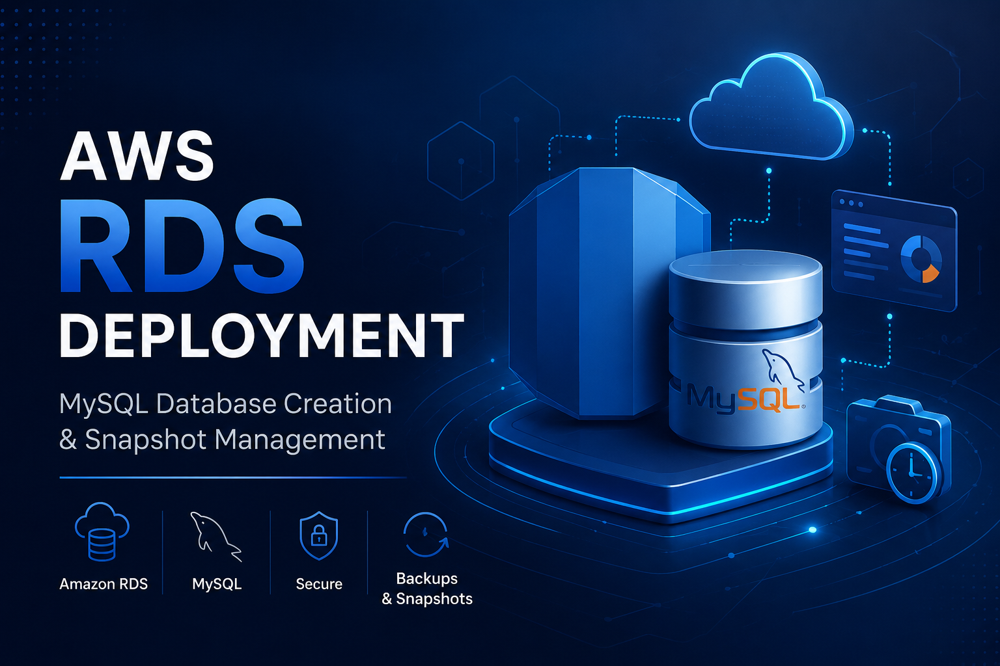
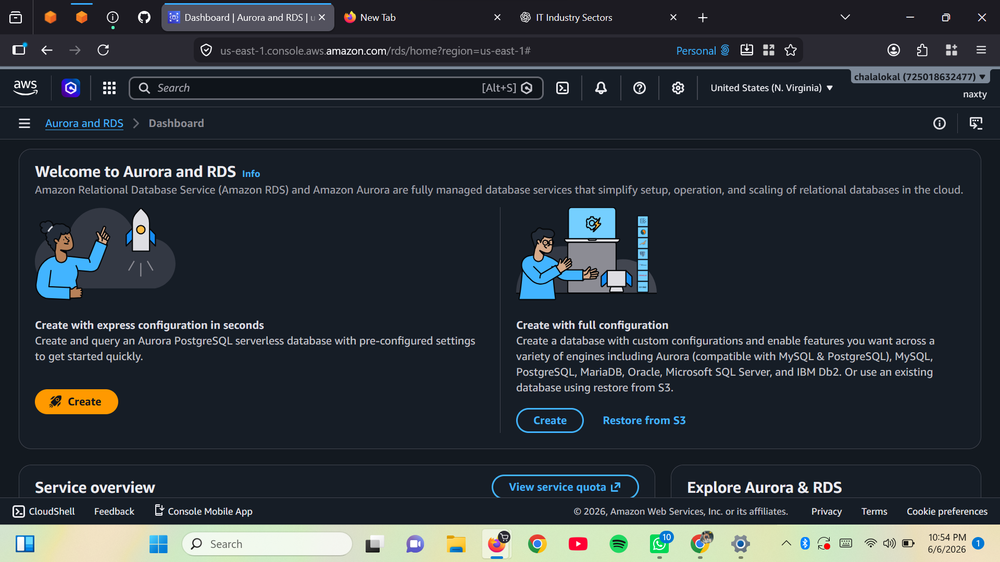
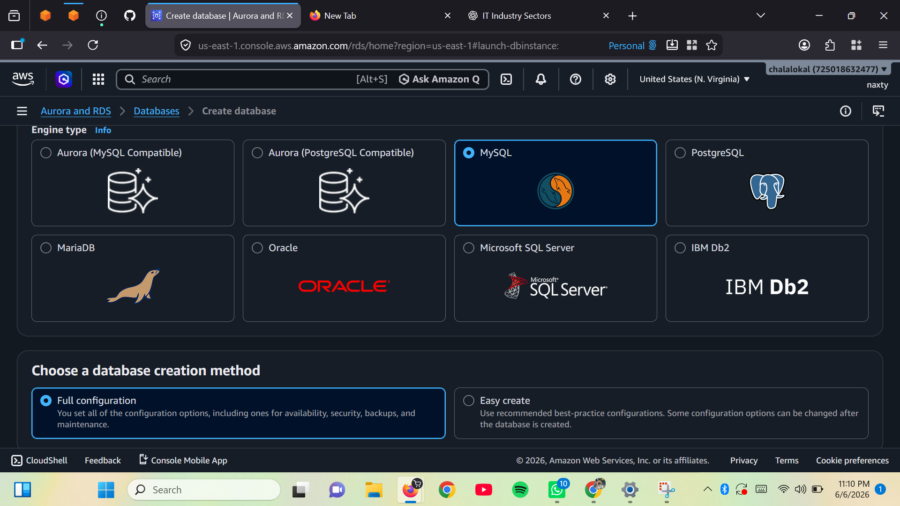
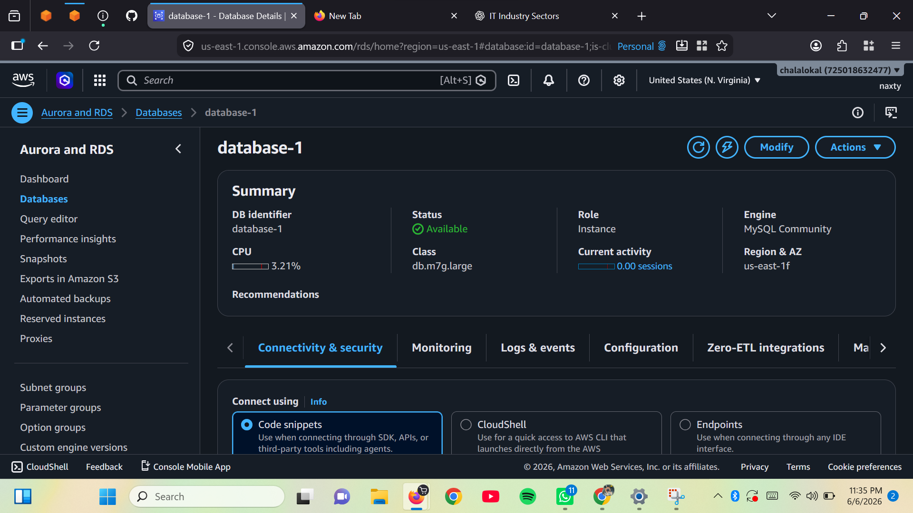
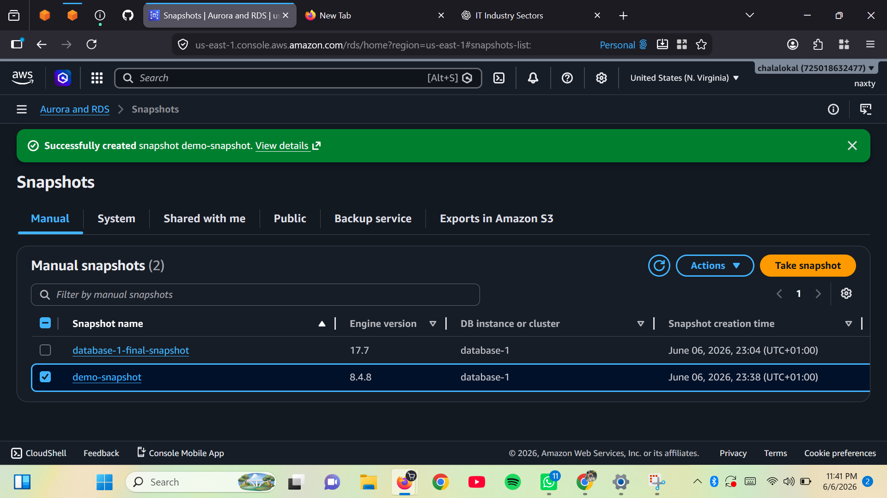

# AWS-RDS-MySQL-DEPLOYMENT

> *Hands-on AWS project demonstrating Amazon RDS MySQL database deployment, configuration, security settings, and backup snapshot creation.*


## Project Objective

Create a MySQL database instance using Amazon RDS and create a manual snapshot for backup and recovery purposes.

---

## AWS Services Used

- Amazon RDS
- MySQL
- Amazon VPC
- Security Groups
- RDS Snapshots

---

## Architecture
```
AWS Cloud
│
├── Amazon RDS
│   └── MySQL Database Instance
│
├── VPC
│   ├── Subnets
│   └── Security Groups
│
└── Automated & Manual Snapshots
```
---

## Step 1: Access Amazon RDS

- Logged into the AWS Management Console.
- Navigated to the Amazon Aurora & RDS service.
- Selected **Create Database**.



---

## Step 2: Configure Database

- Chose **Standard Create** as the database creation method.
- Selected **MySQL** as the database engine.
- Chose the appropriate template (Free Tier or Dev/Test).
- Configured the DB instance identifier, master username, and password.



---

## Step 3: Configure Instance and Storage

- Selected a burstable instance class (e.g., `db.t3.micro`).
- Configured storage using General Purpose SSD (`gp3`).
- Set the desired storage allocation.

---

## Step 4: Configure Connectivity

- Selected the VPC and subnet settings.
- Configured security group rules.
- Allowed MySQL access through port `3306`.
- Enabled or disabled public access based on project requirements.

---

## Step 5: Configure Additional Settings

- Specified an initial database name.
- Enabled automated backups.
- Reviewed monitoring and maintenance settings.

---

## Step 6: Create Database

- Reviewed all database configurations.
- Clicked **Create Database**.
- Waited for the database status to change from **Creating** to **Available**.

---

## Step 7: Verify Database

- Accessed the database details page.
- Verified the endpoint, port, and database information.
- Confirmed that the database instance was successfully deployed.



---

## Step 8: Create Manual Snapshot

- Selected the RDS database instance.
- Opened the **Actions** menu.
- Chose **Take Snapshot**.
- Entered a snapshot identifier.
- Created the snapshot.

---

## Step 9: Verify Snapshot Creation

- Navigated to **RDS → Snapshots**.
- Confirmed that the snapshot status changed to **Available**.



---

## Outcome

Successfully created an Amazon RDS instance using the MySQL engine, configured networking and security settings, and generated a manual snapshot for backup and recovery purposes.

---

## Author

Elochukwu Princewill

Cloud Computing • Cybersecurity 

---

## ⭐ If you found this project helpful

Feel free to ⭐ star this repository and explore my other AWS hands-on projects as I continue building practical cloud engineering solutions.

---


